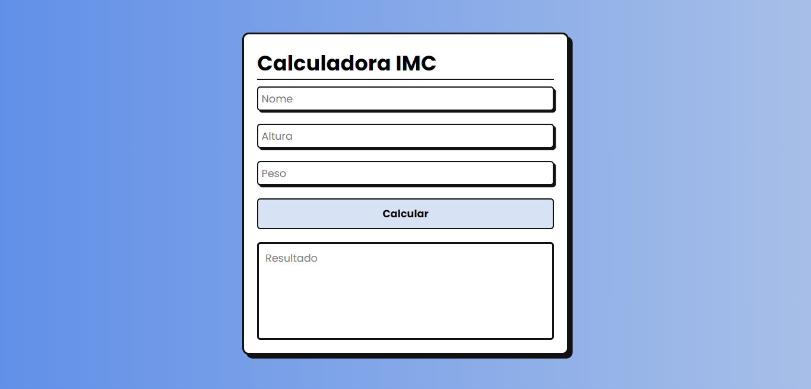

<h1 align="center"> Calculadora de IMC (Índice de Massa Corporal) </h1>

Esta é uma aplicação web simples para calcular o Índice de Massa Corporal (IMC) de uma pessoa. O IMC é uma medida amplamente utilizada para avaliar se uma pessoa está com peso adequado em relação à sua altura.

  <a href="#funcionalidades">Funcionalidades</a>&nbsp;&nbsp;&nbsp;|&nbsp;&nbsp;&nbsp;
  <a href="#tecnologias-utilizadas">Tecnologias Utilizadas</a>&nbsp;&nbsp;&nbsp;|&nbsp;&nbsp;&nbsp;
  <a href="#estrutura-do-projeto">Estrutura do Projeto</a>&nbsp;&nbsp;&nbsp;|&nbsp;&nbsp;&nbsp;
  <a href="#como-usar">Como Usar</a>&nbsp;&nbsp;&nbsp;|&nbsp;&nbsp;&nbsp;
  <a href="#contato">Contato</a>

  

  

## Funcionalidades

- **Cálculo do IMC:** Insira seu peso e altura para calcular seu IMC.
- **Classificação:** Apresenta a classificação do IMC de acordo com os valores padrão (Abaixo do peso, Peso normal, Sobrepeso, Obesidade I, Obesidade II, Obesidade III).

## Tecnologias Utilizadas

- **HTML:** Estruturação básica da página web.
- **CSS:** Estilização para uma interface bonita e responsiva.
- **JavaScript:** Lógica de programação para realizar o cálculo do IMC.
- **POO (Programação Orientada a Objetos):** Utilização de classes para organizar o código JavaScript.

## Estrutura do Projeto

- **index.html:** Contém a estrutura HTML da aplicação.
- **style.css:** Arquivo CSS para estilização da página.
- **script.js:** Lógica de programação em JavaScript, utilizando orientação a objetos.

## Como Usar

1. Clone ou baixe o repositório para o seu computador.
2. Abra o arquivo `index.html` em seu navegador web.
3. Insira seu peso e altura nos campos indicados.
4. Clique no botão "Calcular".
5. O resultado do seu IMC será exibido junto com sua classificação.

## Contato

- Acesse também meus outros repositórios no [Github](https://github.com/matheusfdosan?tab=repositories).

- Também me siga no [Instagram](https://instagram.com/matheusfdosan).

- Crie conexão comigo em meu [Linkedin](https://www.linkedin.com/in/matheusfaus/)